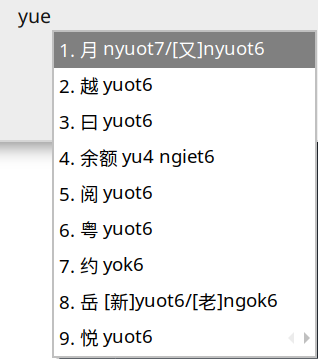
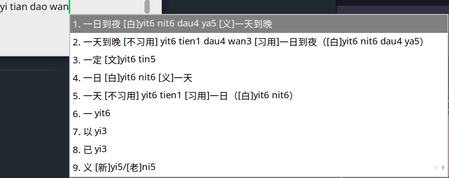

# GonnyuGeneralIME — A General Gon(Gan) Chinese Input Method

> A digital writing system rooted in the Gon(Gan)–Poyang region.

We have established three dictionary localities: urban Lancong (Nanchang), Fenni (Fenyi County in Xinyu), and Fungcen. We hope to expand substantially to other localities as well. Contributions to add and correct dictionary entries are welcome.

**An easy-to-use Gon(Gan) input method: users who know Pinyin can type immediately, with both local and Mandarin Pinyin input supported.**

**Native installation is available on macOS, Android, Windows, and Linux, alongside Rime resource packages.**

[](https://github.com/Doohaey/GonnyuGeneralIME-Rime-Lancong)
[](https://github.com/Doohaey/GonnyuGeneralIME-Rime-Fenni)

Rime schema repositories for Lancong(Nanchang) and Fenni(Fenyi). Other installation options, including Fungcen resources, are available in the [Installation](#installation) section below.

## Release 1.0.1

- feat: initialise the Fungcen dictionary
- feat: add Gan original characters for Lancong (Nanchang) and Fungcen

## Contents

- [GonnyuGeneralIME — A General Gon(Gan) Chinese Input Method](#gonnyugeneralime--a-general-gongan-chinese-input-method)
  - [Release 1.0.1](#release-101)
  - [Contents](#contents)
  - [Overview](#overview)
    - [What it provides](#what-it-provides)
  - [See Gan in action](#see-gan-in-action)
    - [No learning needed, type by instinct](#no-learning-needed-type-by-instinct)
    - [Broad vocabulary, local life in full, rare characters no longer a barrier](#broad-vocabulary-local-life-in-full-rare-characters-no-longer-a-barrier)
    - [Gan and Mandarin, side by side](#gan-and-mandarin-side-by-side)
    - [Mandarin Pinyin, straight to Gan](#mandarin-pinyin-straight-to-gan)
    - [Literary or colloquial — clear at a glance](#literary-or-colloquial--clear-at-a-glance)
    - [Every Gan reading welcome, old and new](#every-gan-reading-welcome-old-and-new)
  - [Installation](#installation)
    - [macOS](#macos)
    - [iOS](#ios)
    - [Android](#android)
    - [Windows](#windows)
    - [Linux: Fcitx5](#linux-fcitx5)
    - [Linux: IBus](#linux-ibus)
    - [Rime](#rime)
  - [The Gon-pin Romanisation](#the-gon-pin-romanisation)
    - [Initials](#initials)
    - [Finals](#finals)
      - [Open finals](#open-finals)
      - [Front-vowel finals](#front-vowel-finals)
      - [Rounded finals](#rounded-finals)
      - [Rounded front-vowel finals](#rounded-front-vowel-finals)
      - [Syllabic nasals](#syllabic-nasals)
      - [Other segments](#other-segments)
    - [Lancong(Nanchang) tones](#lancongnanchang-tones)
  - [References](#references)
    - [Literature](#literature)
    - [Dependency declarations](#dependency-declarations)
    - [Licensing and rights reservation](#licensing-and-rights-reservation)
    - [Acknowledgements](#acknowledgements)
  - [Why Gon(Gan) Chinese Matters](#why-gongan-chinese-matters)
  - [Contributors and contact](#contributors-and-contact)

## Overview

The idea for GonnyuGeneralIME emerged in the second half of 2025. We began by assembling a basic dictionary from published descriptions of the relationship between Gon(Gan) pronunciation and Chinese characters. It soon became clear that a simple character-to-sound mapping would not be enough. The project is intended as a more systematic, durable record of language materials from different Gon(Gan)-speaking localities.

It is therefore designed not only for writing Chinese characters from Gon(Gan) pronunciation, but also for moving naturally between Gon(Gan) and Mandarin in writing. It is for fluent speakers, younger people who have heard Gon(Gan) but do not yet command it, and anyone interested in producing idiomatic Gon(Gan) Chinese text.

“General” has three meanings here: usable across Gon(Gan) localities; usable in both Gon(Gan) and Mandarin contexts; and available across major computing platforms.

The project favours established character forms while accommodating common vernacular spellings. Its aim is a practical, readable written Gon(Gan) that reflects everyday life in the region as well as its historical Chinese roots.

### What it provides

Beyond the dictionaries themselves, the input method currently provides:

- Pronunciation annotations for characters and words. The spelling system and tone notation are described below. It stays close to Hanyu Pinyin where possible to reduce the learning curve.
- Tolerant input for spelling habits familiar to Mandarin-input users, while presenting results in the project’s own spelling.
- Cross-references between common Mandarin words and local Gon(Gan) vocabulary. When either side is found, the corresponding expression is also offered as a candidate.
- Compatible input and clear annotation for literary and colloquial readings, newer and older readings, and other alternate pronunciations.

The project currently maintains three regional dictionaries: urban Lancong (Nanchang), Fenni (Fenyi County in Xinyu), and Fungcen. We hope to expand substantially to other localities as well. Contributions to add and correct dictionary entries are welcome.

## See Gan in action

<sub>The examples below use Nanchang Gan.</sub>

### No learning needed, type by instinct

Know Mandarin Pinyin and start typing right away. Enter a familiar Pinyin spelling, and the input method finds the corresponding Gan reading without requiring a separate input scheme.



### Broad vocabulary, local life in full, rare characters no longer a barrier

Over 20,000 Chinese characters, including extensive coverage of Unicode Extension B with theoretical readings derived from rhyme dictionaries; over 100,000 words; abundant idiomatic local expressions; and distinctive pronunciations for place names. The dictionary goes far beyond a bare list of character readings.


### Gan and Mandarin, side by side

Type in Gan and see related Mandarin words at the same time. Recognise, confirm, and choose the word you want in one glance.


### Mandarin Pinyin, straight to Gan

Have the Mandarin word in mind first? Type its familiar Pinyin and find the Gan expression right away.



### Literary or colloquial — clear at a glance

Gan everyday speech and written expression can sound different. The input method lays both readings out clearly, so your writing always fits the moment.


### Every Gan reading welcome, old and new

Alternate Gan pronunciations, including older and newer patterns, are all ready for input and lookup. Type the Gan you know, your way.


## Installation

The native input method is available for macOS, Linux, Android, and Windows. iOS uses the universal Rime resource package; see the Rime section for installation.

Download the file for your operating system or locality from [Releases](https://github.com/Doohaey/GonnyuGeneralIME/releases).

### macOS

Download `GonnyuGeneralIME-version-macos.pkg` from [Releases](https://github.com/Doohaey/GonnyuGeneralIME/releases), open it, and complete the installation.

If it does not appear automatically, open **System Settings → Keyboard → Text Input → Edit…**, click **+**, search for and add **Gonnyu**, then select it from the input menu. Upgrades preserve the user dictionary.

### iOS

For input on iOS, see the Rime section.

### Android

Download `GonnyuGeneralIME-version-android.apk` and open it on Android to install. On first launch, follow the in-app setup to enable the Gon(Gan) Chinese input method, then select it from the system input-method picker.

### Windows

Download and run `GonnyuGeneralIME-version-windows-installer.exe`. After the installer finishes, open **Settings → Time & language → Language & region → Chinese (Simplified) → Keyboards** and add **Gannyu**.

### Linux: Fcitx5

Download `GonnyuGeneralIME-version-fcitx5.tar.gz`, extract it, and run the installer included in the archive:

```sh
tar -xzf GonnyuGeneralIME-version-fcitx5.tar.gz
cd GonnyuGeneralIME-version-fcitx5
./install.sh
```

Restart Fcitx5 with `fcitx5 -r`, or sign out and back in. Then add **Gannyu Gon(Gan) / 赣语** in `fcitx5-configtool`.

### Linux: IBus

Download `GonnyuGeneralIME-version-ibus.tar.gz`, extract it, and run the installer included in the archive:

```sh
tar -xzf GonnyuGeneralIME-version-ibus.tar.gz
cd GonnyuGeneralIME-version-ibus
./install.sh
```

Run `ibus-daemon -drx` (or restart IBus), then add **Gannyu Gon(Gan)** in the input-method list in `ibus-setup`.

### Rime

Download `GonnyuGeneralIME-version-rime-region.zip` for the required locality. The archive works with Rime front ends on every platform.

For Windows Weasel, copy the archive contents into `%APPDATA%\Rime` and redeploy from the input-method menu. For Linux Fcitx5 Rime, copy the contents into `~/.local/share/fcitx5/rime/`, redeploy, then select the locality from the schema menu. For iOS and Android, import or deploy the ZIP in the installed Rime front end.

## The Gon-pin Romanisation

**Data note:** We focus on maintaining the accuracy of the romanisation in the dictionary files, but cannot yet guarantee the consistency or accuracy of the IPA data, because it is only imported as an aid during dictionary construction and is unrelated to user-visible input.

The spelling system is intended to represent Gon(Gan) pronunciation while remaining as close as practical to the conventions of Hanyu Pinyin. To make typing easier and to accommodate mergers in newer varieties, some spellings deliberately accept more than one phoneme in a strict phonological sense.

### Initials

| gon-pin | Default IPA | Yikyan IPA | Fungcen IPA | Accepted alternative input | Notes |
| --- | --- | --- | --- | --- | --- |
| b | [p] | - | — | |
| p | [pʰ] | - | — | |
| m | [m] | - | — | |
| f | [f] | - | — | May differ from Mandarin *f*; some descriptions use [ɸ]. |
| d | [t] | - | — | |
| t | [tʰ] | - | — | |
| l | [l] | - | — | |
| z | [ts] | - | — | |
| c | [tsʰ] | - | — | |
| s | [s] | - | — | |
| j | [tɕ] | - | — | |
| q | [tɕʰ] | - | — | |
| n | [ȵ] | - | — | |
| x | [ɕ] | - | — | |
| g | [k] | - | — | |
| k | [kʰ] | - | — | |
| ng | [ŋ] | - | — | A velar nasal; for example, 五 *ng3*. |
| h | [h] | - | [x] | In Fungcen, IPA [x] is written with Gan-pinyin h; articulated farther back than Mandarin *h*. |

### Finals

**Compatibility for checked-tone syllables.** Final apical stops `-t` [t] and glottal stops `-k` [ʔ] may be omitted. The two are also accepted interchangeably, so the input method can still recognise a checked-tone syllable when its coda is entered differently. This reflects the weakening and ambiguity of checked tones in Gon(Gan): some are difficult to distinguish from neutral tone, and some localities no longer retain them.

#### Open finals

| gon-pin | Default IPA | Yikyan IPA | Fungcen IPA | Accepted alternative input | Notes |
| --- | --- | --- | --- | --- | --- |
| a | [a] | - | - | — | |
| ae | - | - | [æ] | — | |
| o | [o] or [ɵ] | - | - | — | |
| e | [e] | [ɛ] or [ə] or [ɯ] | [ɛ] | — | |
| ai | [ai] | - | - | — | |
| oi | [oi] | - | - | — | |
| ei | [ei] or [ɨi] | - | [ɛi] | — | [ei] is only a contracted vowel. |
| au | [au] | - | [ɑu] | ao | |
| eu | [ɛu] or [ɨu] | - | [əu] | ou (after some initials) | |
| an | [an] | - | - | — | |
| am | - | - | [am] | — | |
| en | [ɛn] or [ɨn] | - | [ən] | — | |
| on | [on] | - | - | — | |
| ang | [ɑŋ] | - | - | — | |
| ong | [ɔŋ] | - | [oŋ] | on (Yikyan) | Yikyan does not distinguish front and back variants of ong. |
| eng | - | [ən] | - | en (Yikyan) | Most speakers no longer distinguish en and eng. |
| at | [at] | - | - | — | |
| ap | - | - | [ap] | — | |
| ot | [ot] | - | [ɵt] | — | |
| op | - | - | [ɵp] | — | |
| et | [ɛt] or [ɨt] | - | - | — | |
| ak | [aʔ] | - | - | — | |
| aek | - | - | [æʔ] | — | |
| aet | - | - | [æt] | — | |
| aep | - | - | [æp] | — | |
| ok | [ɔʔ] | - | [oʔ] or [ɵʔ] | — | |
| ek | - | [ɛʔ] or [ɤʔ] | [ɛʔ] or [ɨʔ] | — | [ɤʔ] can be written ek or uk. |

#### Front-vowel finals

With no initial consonant:

- Before `-a`, `-o`, or `-e`, initial `i` is written `y`.
- In other positions, it is written `yi`.

| gon-pin | Default IPA | Yikyan IPA | Fungcen IPA | Accepted alternative input | Notes |
| --- | --- | --- | --- | --- | --- |
| i | [i] or [ɿ] | - | - | — | |
| ia | [ia] | - | - | — | |
| iat | - | - | [iat] | - | |
| ie | [iɛ] | - | - | — | |
| iep | - | - | [iɛp] | — | |
| iu | [iu] | - | - | you (no initial) | |
| io | - | - | [iɔ] | - | |
| ieu | [iɛu] | [iəu] or [iɛu] | [iɛu] or [iəu] | - | |
| in | [in] | - | - | — | |
| ien | [iɛn] | - | - | - | |
| ian | - | - | [ian] | - | |
| iang | [iɑŋ] | - | - | - | |
| iau | - | - | [iau] | - | |
| im | - | - | [im] | - | |
| ing | - | - | [iŋ] | - | |
| iong | [iɔŋ] | - | [ioŋ] | - | |
| iung | [iuŋ] | - | - | - | |
| it | [it] | - | - | it | |
| ip | - | - | [ip] | - | |
| iap | - | - | [iap] | - | |
| iet | [iet] | - | - | - | |
| ik | - | [iʔ] or [ɪʔ] | [iʔ] |  | |
| iak | [iaʔ] | - | - | - | |
| iok | [iɔʔ] | - | - | - | |
| iek | - | [iɛʔ] | [iɛʔ] |  | |
| iuk | [iuʔ] | - | - | - | |

#### Rounded finals

With no initial consonant:

- Before `-a`, `-o`, or `-e`, initial `u` is written `w`.
- In other positions, it is written `wu`.

| gon-pin | Default IPA | Yikyan IPA | Fungcen IPA | Accepted alternative input | Notes |
| --- | --- | --- | --- | --- | --- |
| u | [u] | - | - | - | |
| ua | [ua] | - | - | - | |
| uo | [uo] | - | - | - | |
| ue | [ue] | - | [uɛ] | - | |
| ui | [uei] | - | [uɛi] or [ui] | uei, wei (no initial), wi | |
| uie | - | - | [uiɛ] | - | |
| uin | - | - | [uin] | - | |
| uai | [uai] | - | - | - | |
| uoi | - | [uoi] | - | oi | |
| un | [un] or [uen] | - | [uɛn] | uen | |
| uan | [uan] | - | - | - | |
| uon | [uon] | - | - | uen, wen (no initial) | |
| ung | [uŋ] | - | - | — | |
| uang | [uɑŋ] | - | - | - | |
| uong | [uɔŋ] | - | [uoŋ] | uon (Yikyan) | |
| ut | [ut] | - | - | - | |
| uat | [uat] | - | - | - | |
| uot | [uot] | - | - | - | |
| uet | [uɛt] | - | [uɨt] | - | |
| uk | [uʔ] | [uʔ] or [ɤʔ] | - | - | |
| uak | [uaʔ] | - | - | - | |
| uaek | - | - | [uæʔ] | - | |
| uaet | - | - | [uæt] | - | |
| uok | [uoʔ] | - | [uɔʔ] | - | |
| uik | - | - | [uɛiʔ] | uek | |
| uek | — | [uɛʔ] or [uɤʔ] or [uɪʔ] | [uɛʔ] or [uɨʔ] | uik | |

#### Rounded front-vowel finals

`yu` is provisionally used throughout for [y].

| gon-pin | Default IPA | Yikyan IPA | Fungcen IPA | Accepted alternative input | Notes |
| --- | --- | --- | --- | --- | --- |
| yu | [y] | - | - | y, v, u | |
| yuo | - | - | [yɵ] | - | |
| yue | [ye] | - | - | - | |
| yun | [yn] | - | - | — | |
| yuon | [yon] | - | - | yuen, yoin | |
| yuen | - | [yɛn] or [yɛŋ] | - | yueng | |
| yung | - | [yn] | [yŋ] or [iuŋ] | yun | |
| yut | [yt] | - | - | - | |
| yuk | - | - | [yʔ] or [iuʔ] | - | |
| yuot | [yot] | - | - | yue, yuet | |
| yuet | - | - | [yet] | yuot | |
| yuak | - | [yaʔ] | - | - | |
| yuok | - | [yɔʔ] | [yɵʔ] | - | |
| yuek | - | [yɛʔ] or [yɪʔ] | - | yuik | |

#### Syllabic nasals

| gon-pin | Default IPA | Yikyan IPA | Fungcen IPA | Notes |
| --- | --- | --- | --- |
| m | [m̩] | - | - | |
| n | [n̩] | - | - | |
| ng | [ŋ̩] | - | - | |

#### Other segments

The system also records a number of extensions based on published descriptions and observed sound changes, including pronunciations recorded in a 1935 language survey and selected alternations involving `-n` and `-ng` codas.

### Lancong(Nanchang) tones

The Lancong(Nanchang) dictionary uses seven tone markers:

| Marker | Traditional tone category | Example Lancong(Nanchang) pitch |
| --- | --- | --- | --- |
| 1 | yin level | 42 |
| 2 | yang level | 24 |
| 3 | rising | 213 |
| 4 | yin departing | 44(5) |
| 5 | yang departing | 21 |
| 6 | yin checked | 5 |
| 7 | yang checked | 1 or 2 |

### Fungcen tones

The Fungcen dictionary uses six tone markers:

| Marker | Traditional tone category | Fungcen pitch | 
| --- | --- | --- |
| 1 | yin level | 33 |
| 2 | yang level | 35 |
| 3 | rising | 213 |
| 4 | departing | 31 |
| 5 | yin checked | 1 |
| 6 | yang checked | 5 |

## References

In addition to participants’ own field observations, the project draws on academic work and dialect-enthusiast communities. A project of this kind necessarily synthesises many sources. The reference material and dictionary data used here have been made public as far as possible. Please raise any copyright concerns through the project repository.

### Literature

1. osfans. **MCPDict** [CP/OL]. GitHub. <https://github.com/osfans/MCPDict>.
2. Xiong Zhenghui. *Literary and colloquial readings in the Lancong(Nanchang) dialect* [EB/OL]. <http://ling.cass.cn/keyan/xueshuchengguo/cgtj/202112/W020211223381176680381.pdf>. Accessed 2026-06-01.
3. Xiong Zhenghui. *Difficult characters in the Lancong(Nanchang) dialect* [EB/OL]. <http://ling.cass.cn/keyan/xueshuchengguo/cgtj/202112/W020211223381177519680.pdf>. Accessed 2026-06-04.
4. Xiong Zhenghui. *Dictionary of the Lancong(Nanchang) Dialect*.
5. Zhihu. “What vocabulary is distinctive enough to identify Gon(Gan) Chinese at once?” <https://www.zhihu.com/question/24262923/>.
6. Wikipedia. *Gon(Gan) Chinese original characters*. <https://gan.wikipedia.org/wiki/>.
7. Wikipedia. *Gon(Gan) Chinese*. <https://zh.wikipedia.org/zh-hans/%E8%B4%9B%E8%AA%9E>.
8. *Character-use standards for Chinese dialects, Language Resources Protection Project of China*. <http://www.moe.gov.cn/s78/A19/tongzhi/201704/W020170405307025943395.pdf>. Accessed 2026-08-04.
9. Bilibili. *New Concept Lancong(Nanchang) Dialect* series. <https://www.bilibili.com/video/BV1Us4y1C7fp/?share_source=copy_web&vd_source=5078721afbb2afc4394ca2602bb990de>.

### Dependency declarations

The mobile input engine directly uses the following open-source projects. Exact revisions are pinned by the build lock; distributions retain the corresponding licences and copyright notices.

1. RIME Developers. **librime** `1.17.0`, BSD 3-Clause License. <https://github.com/rime/librime>
2. librime-lua Developers. **librime-lua** commit `ad1e4a6c98abf634dd34242a747f9b1d5d069fbe`, BSD 3-Clause License. <https://github.com/hchunhui/librime-lua>

### Licensing and rights reservation

The main body of this project is licensed under the GNU GPLv3; see `LICENSE` for details.
The name and branding “赣语通用输入法” (abbreviated as “赣语输入法”), together with the image at
`resources/icon.png`, are not covered by the GPLv3. All related copyrights, trademark rights,
and other rights are reserved by their respective rights holder. Use of the name or image in
derivative projects, redistributions, or commercial promotion requires permission.

### Acknowledgements

Special thanks to @豫章鸿也 for extensive advice on the project’s romanisation and character and word choices.

Given the scale of the dictionaries and the author's limited expertise and time, errors may remain. The author takes responsibility for them. Thank you to everyone who contributes additions and corrections.

## Why Gon(Gan) Chinese Matters

The Gon(Gan)–Poyang plain has long been a major cultural and economic centre in southern China. Since the late Qing period, however, Jiangxi and neighbouring areas have experienced serious economic and demographic decline. When the material basis of a cultural tradition erodes, its public standing tends to erode with it. Among the Sinitic languages, Gon(Gan) now has one of the weakest public profiles.

Gon(Gan)-speaking areas do not have a single, clearly recognised standard pronunciation. They lack the commercial reach often associated with Cantonese, the economic base of Wu varieties, the familiar cultural symbols and overseas presence of Southern Min, or the dense urban networks of Sichuan. Many people who speak Gon(Gan), or grew up in a Gon(Gan)-speaking area, have only a hazy sense of it as a language: it may be called “Jiangxi speech”, or treated as one of many indistinct local ways of speaking. The commonplace observation that speech changes from village to village has too often become an excuse to see only fragmentation.

Across the region, language shift has been rapid. Local speech has frequently been treated as rustic, backward, or improper, and Mandarin has displaced it in family life and education. Yet replacement is never so clean. People educated first in Mandarin may still carry deep Gon(Gan) patterns into pronunciation, everyday vocabulary, and writing; what emerges can be neither a secure command of Mandarin nor an unbroken command of the language of home.

The examples matter. A Gon(Gan) expression such as `好 X` (literally “good X”, used as an intensifier) may be “corrected” in school to Mandarin `很 X` (“very X”). A speaker may write `紧` (*jǐn*) for “always”, reflecting the `尽` in `尽管`—a word that in standard Mandarin means “although”—or use `嘎` (*gà*) as a sentence-initial particle. These are not errors to be replaced by convenient English equivalents: they are traces of how Gon(Gan) structures thought and expression inside Chinese writing. Some younger people of Lancong(Nanchang) background now struggle even to understand Lancong(Nanchang) Gon(Gan) or distinguish it from neighbouring varieties; that degree of language loss is itself unusual and consequential.

When reports warn that much of the world’s linguistic diversity may disappear this century, Chinese-speaking communities may assume that the warning concerns someone else. But the languages spoken at home and in one’s hometown can disappear as well. With them go social memory, local ways of speaking, and the texture of past life. Preserving and extending the written life of Gon(Gan) is one small part of protecting that diversity.


## Contributors and contact

1. Dongche Xiye Editorial Department. Project planning and the Fenni(Fenyi) dictionary. <https://github.com/ComeRainOrComeShine>
2. Doohaey. Input-method framework and the Lancong(Nanchang) dictionary. Email: doohaey@gmail.com
