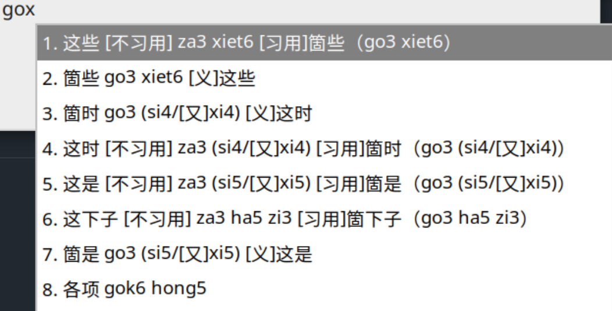
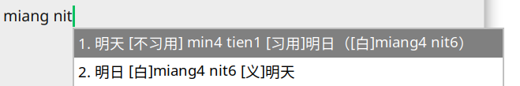
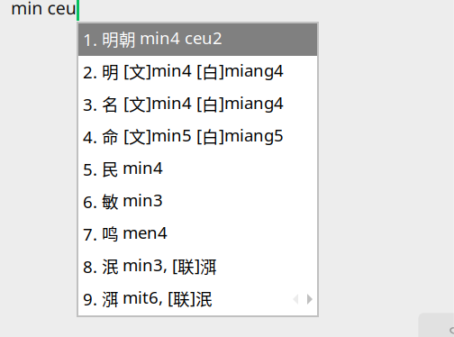
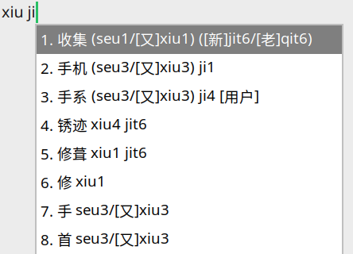

# 赣语通用输入法 GonnyuGeneralIME

> 一种属于赣鄱大地的数字化书写方案。

目前支持：**南昌话、分宜话**，更多地区等你来接入！

**一键安装/简单易用/日常可用的赣语输入法，会拼音就能使用，方言拼音与普通话兼容支持。不会说赣语也能用来玩！用赣语思维也可以轻松大段输出普通话文本（比如本文）！**

**现已支持全平台快捷安装以及各平台Rime安装包。**

[](https://github.com/Doohaey/GonnyuGeneralIME-Rime-Lancong)
[](https://github.com/Doohaey/GonnyuGeneralIME-Rime-Fenni)

上方按钮列出南昌话与分宜话的 Rime 方案仓库。其他安装方案请在下方[安装方法](#安装方法)小节找到对应平台内容下载并且安装。

## 测试版本 0.2.4-pre.3

- chore: 赣－普通话对应小标题修改为习用与否。
- feat(dict): 增补吴城词典可参考内容。
- fix：安卓词典加载问题。

## 目录

- [赣语通用输入法 GonnyuGeneralIME](#赣语通用输入法-gonnyugeneralime)
  - [测试版本 0.2.4-pre.3](#测试版本-024-pre3)
  - [目录](#目录)
  - [简介](#简介)
    - [特色](#特色)
  - [功能演示](#功能演示)
    - [赣语与普通话，同屏就能选](#赣语与普通话同屏就能选)
    - [普通话拼音，直达赣语](#普通话拼音直达赣语)
    - [文白异读，分得清也选得到](#文白异读分得清也选得到)
    - [多读音、新老派，都照顾到](#多读音新老派都照顾到)
  - [安装方法](#安装方法)
    - [macOS](#macos)
    - [iOS](#ios)
    - [Android](#android)
    - [Windows](#windows)
    - [Linux：Fcitx5](#linuxfcitx5)
    - [Linux：IBus](#linuxibus)
    - [Rime](#rime)
  - [本输入法采用的赣语拼音方案](#本输入法采用的赣语拼音方案)
    - [声母](#声母)
    - [韵母](#韵母)
      - [开口呼韵母](#开口呼韵母)
      - [齐齿呼韵母](#齐齿呼韵母)
      - [合口呼韵母](#合口呼韵母)
      - [撮口呼韵母](#撮口呼韵母)
      - [边鼻韵](#边鼻韵)
      - [其他音素](#其他音素)
    - [补充：南昌声调](#补充南昌声调)
  - [参考资料](#参考资料)
    - [参考资料](#参考资料-1)
    - [致谢](#致谢)
  - [缘起：赣语的失落](#缘起赣语的失落)
  - [参与名单与联系方式](#参与名单与联系方式)

## 简介

2025年下半年，我们萌生制作赣语通用输入法的想法。在此之前，我们对其他汉语的输入法有过一定观察。起初，我们把赣语语音与文字的对应依靠多种资料进行了整理，建立了最基本的词典。但是很快，我们认为这样的简单对应似乎还不足以适合我们现有的需求。我们希望以另一种形式系统性整理保存赣语各个点位的语料。因此就有了我们现有的项目设想：不仅是可以以赣语语音输入汉字，还要能让使用者可以用赣语思维顺利输入普通话，也可以让赣语不太熟练但是听过的年轻一代，抑或只是对赣语感兴趣的爱好者，都可以借此输入地道的赣语文本。

由此可见，我们的“通用“有三个含义。第一，是在赣语各个点位通用。第二，是赣语普通话之间通用。第三，是技术意义上全平台通用。

我们项目尽可能使用地道的本字、正字，兼顾民间常用写法，以推动一种规范且兼顾通俗的地方汉语文本，展现赣语社会生活的烟火气及中华古代文化根源。

### 特色

除基本词典之外，已经实现的功能有：

- 对字词等进行标音，拼音方案和调号将在下面解释。本套拼音方案大体上是接近汉语拼音方案的，主要是出于低学习成本上手的考虑。
- 兼容普通话输入法使用者容易使用的习惯拼写方法。当然，最终显示还是以本套方案拼音为准。
- 对普通话常用词与赣语点位常用词进行对应。互相进行解释。当被对应的一方被索引到候选词列表时，另一方也会出现，以方便使用赣语输入普通话或使用普通话输入赣语的目的。
- 对于词汇文白读音，新派老派读音，或者一些另读进行兼容输入和清晰标注。

目前，我们已经建成南昌市区和新余市分宜县两个词典点位。另希望就别的点位进行充分扩展。欢迎参与我们的词典增添与校正!

## 功能演示

<sub>以下演示以南昌话输入部分为例。</sub>

### 赣语与普通话，同屏就能选

输入赣语，相关普通话词也会一起出现；理解、确认、选词，一步到位。



### 普通话拼音，直达赣语

先想到普通话词？照样用汉语拼音输入，马上找到对应的赣语说法。


### 文白异读，分得清也选得到

赣语的日常口语和书面表达各有读法；输入法清楚整理，写得更贴切。





### 多读音、新老派，都照顾到

不同赣语读音都能输入、都能找到；无论习惯新派还是老派，说话的声音不必将就。




## 安装方法

输入法主体覆盖 Linux、Android 和 Windows。macOS 与 iOS 的 输入法目前只能使用通用 Rime 资源包，安装方法见 Rime 章节。

从 [Releases](https://github.com/Doohaey/GonnyuGeneralIME/releases) 下载与系统相符或者对应区域的文件。

### macOS

macOS 上使用输入法时，见 Rime 章节。

### iOS

iOS 上使用输入法时，见 Rime 章节。

### Android

下载 `GonnyuGeneralIME-版本号-android.apk`，在 Android 系统中打开并安装。首次打开应用后，按应用内引导启用“赣语输入法”，再在系统输入法选择器中切换至它。

### Windows

下载并运行 `GonnyuGeneralIME-版本号-windows-installer.exe`，按安装向导完成安装。随后在“设置 → 时间和语言 → 语言和区域 → 中文（简体） → 键盘”中添加“Gannyu”。

### Linux：Fcitx5

下载 `GonnyuGeneralIME-版本号-fcitx5.tar.gz`，解压后运行包内安装程序：

```sh
tar -xzf GonnyuGeneralIME-版本号-fcitx5.tar.gz
cd GonnyuGeneralIME-版本号-fcitx5
./install.sh
```

重启 Fcitx5（`fcitx5 -r`）或注销后重新登录，并在 `fcitx5-configtool` 中添加“Gannyu Gan / 赣语”。

### Linux：IBus

下载 `GonnyuGeneralIME-版本号-ibus.tar.gz`，解压后运行包内安装程序：

```sh
tar -xzf GonnyuGeneralIME-版本号-ibus.tar.gz
cd GonnyuGeneralIME-版本号-ibus
./install.sh
```

运行 `ibus-daemon -drx`（或重启 IBus），然后在 `ibus-setup` 的输入法列表添加“Gannyu Gan”。

### Rime

下载所需区域的 `GonnyuGeneralIME-版本号-rime-地区.zip`。压缩包适用于各 Rime 前端。

macOS 鼠须管将压缩包内容复制到 `~/Library/Rime/`，重新部署后从方案菜单选择对应地区。Windows 小狼毫将内容复制到 `%APPDATA%\Rime`，在输入法菜单中重新部署。Linux Fcitx5 Rime 将内容复制到 `~/.local/share/fcitx5/rime/`，重新部署后从方案菜单选择对应地区。iOS 与 Android 使用所安装 Rime 前端的导入或部署功能载入 ZIP。


## 本输入法采用的赣语拼音方案

**声明**：本项目重点维护`gon-pin`可见实现，词典资源文件背后ipa数据来源多且杂乱，项目暂时不能对数据做任何保证。

为符合输入实际，本项目所使用的拼音在反映赣语发声实际的基础上，尽可能贴近《汉语拼音方案》的拼写模式。为了方便输入，也符合新派音系归并特点，部分音节严格意义上兼容了多个音位。

### 声母

| gon-pin | IPA   | 兼容输入 | 说明                                          |
| ------- | ----- | -------- | --------------------------------------------- |
| b       | [p]   | —        |                                               |
| p       | [pʰ]  | —        |                                               |
| m       | [m]   | —        |                                               |
| f       | [f]   | —        | 实际可能与普通话f有一些差异，有的资料记做[ɸ]. |
| d       | [t]   | —        |                                               |
| t       | [tʰ]  | —        |                                               |
| l       | [l]   | —        |                                               |
| z       | [ts]  | —        |                                               |
| c       | [tsʰ] | —        |                                               |
| s       | [s]   | —        |                                               |
| j       | [tɕ]  | —        |                                               |
| q       | [tɕʰ] | —        |                                               |
| n       | [ȵ]   | —        |                                               |
| x       | [ɕ]   | —        |                                               |
| g       | [k]   | —        |                                               |
| k       | [kʰ]  | —        |                                               |
| ng      | [ŋ]   | —        | 舌根鼻音，例字：五 ng3                        |
| h       | [h]   | —        | 发音位置与普通话h不同，更加靠后。             |

### 韵母

**关于入声的兼容**如下。对于韵母尾部舌尖塞音-t [t]和声门塞音-k [ʔ]，都做了不输入的兼容，如果也做了t<->k兼容，即如果入声输入错误，输入法仍能正常识别。这是考虑到赣语入声本身就比较弱化、模糊，有的入声难以与轻声区分，有些地区没有入声。

#### 开口呼韵母

| gon-pin | IPA         | 兼容输入         | 说明 |
| ------- | ----------- | ---------------- | ---- |
| a       | [a]         | —                |      |
| o       | [o]或[ɵ]    | —                |      |
| e       | [e]         | —                |      |
| ai      | [ai]        | — |  |
| oi      | [oi]        | —                |      |
| ei      | [ei]或[ɨi]   | —       | [ei]仅是合音|
| au      | [au]        | ao               |      |
| eu      | [ɛu]或 [ɨu] | ou（部分声母后） |      |
| an   | [an]         | —    |      |
| en   | [ɛn] 或 [ɨn] | —    |      |
| on   | [on]         | —    |      |
| ang | [ɑŋ] | — |  |
| ong | [ɔŋ] | — |  |
| at | [at] | — |  |
| ot | [ot] | — |  |
| et | [ɛt] 或 [ɨt] | — |  |
| ak | [aʔ] | — |  |
| ok | [ɔʔ] | — |  |

#### 齐齿呼韵母

若该类韵母前零声母：
- i后接-a，-o，-e之时，i转写为y.
- 其他情况下，i转写为yi.

| gon-pin | IPA   | 兼容输入 | 说明 |
| ------- | ----- | -------- | ---- |
| i  | [i] 或 [ɿ]  | —   |      |
| ia | [ia] | — |  |
| ie | [iɛ] | — |  |
| iu | [iu] | you（零声母） |  |
| ieu | [iɛu] | - |  |
| in      | [in]  | —        |      |
| ien     | [iɛn] | - |      |
| iang | [iɑŋ] | - |  |
| iong | [iɔŋ] | - |  |
| iung | [iuŋ] | —        |      |
| it | [it] | it |  |
| iet | [iet] | - |  |
| iak | [iaʔ] | - |  |
| iok | [iɔʔ] | - |  |
| iuk | [iuʔ] | - |  |

#### 合口呼韵母

若该类韵母前零声母：
- u后接-a，-o，-e之时，u转写为w.
- 其他情况下，w转写为wu.

| gon-pin | IPA   | 兼容输入 | 说明 |
| ------- | ----- | -------- | ---- |
| u       | [u]   | -  |      |
| ua | [ua] | - |  |
| uo | [uo] | - |  |
| ue | [ue] | - |  |
| ui | [uei] | wei（零声母）, wi |  |
| uai | [uai] | - |  |
| un | [un]或[uen] | uen |  |
| uan | [uan] | - |  |
| uon | [uon] | uen, wen（零声母） |  |
| ung | [uŋ] | — |   |
| uang | [uɑŋ] | - |  |
| uong | [uɔŋ] | - |  |
| ut | [ut] | - |  |
| uat | [uat] | - |  |
| uot | [uot] | - |  |
| uet | [uɛt] | - |  |
| uk | [uʔ] | - |  |
| uak | [uaʔ] | - |  |
| uok | [uoʔ] | - |  |

#### 撮口呼韵母

暂定全量用yu表示[y].

| gon-pin | IPA   | 兼容输入 | 说明 |
| ------- | ----- | -------- | ---- |
| yu      | [y]   | y, v, u  |         |
| yue | [ye] | - |  |
| yun     | [yn]  | — |      |
| yuon | [yon] | yuen, yoin |  |
| yut | [yt] | - |  |
| yuot | [yot] | yue, yuet |  |

#### 边鼻韵

| gon-pin | IPA | 说明 |
|---------|-----|------|
| m | [m̩] |  |
| n | [n̩] |  |
| ng | [ŋ̩] |  |

#### 其他音素

在以上音节成分之外，实际还参考某些文献和生活中发现的音变做了一些扩充表示。其中，包括了1935年所做的语言调查中所记录的一些发音，以及一些特殊的[-n]、[-ng]韵尾音变。

### 补充：南昌声调

输入法南昌词典的声调使用7个调标记，意义分别如下：

| 标号 | 调类 | 南昌示例调值 |
| --- | --- | --- |
| 1 | 阴平 | 42 |
| 2 | 阳平 | 24 |
| 3 | 上声 | 213 |
| 4 | 阴去 | 44(5) |
| 5 | 阳去 | 21 |
| 6 | 阴入 | 5 |
| 7 | 阳入 | 1 或 2 |

## 参考资料

本项目在制作过程中，除参与者自身生活调查之外，参考了大量相关学术作品与方言爱好者社区的内容。因为语言项目本身性质的缘故，必须从大量来源综合资料。输入法方言词典数据与我们参考的内容已尽可能全部公开，如果有任何版权疑虑，可以联系我们。

### 参考资料

1. osfans. **MCPDict** [CP/OL]. GitHub. <https://github.com/osfans/MCPDict>.
2. 熊正辉. 《南昌方言的文白读》[EB/OL]. <http://ling.cass.cn/keyan/xueshuchengguo/cgtj/202112/W020211223381176680381.pdf>. 访问日期 2026-06-01.
3. 熊正辉. 《南昌方言里的难字》[EB/OL]. <http://ling.cass.cn/keyan/xueshuchengguo/cgtj/202112/W020211223381177519680.pdf>. 访问日期 2026-06-04
4. 熊正辉. 《南昌方言词典》
5. 赣语中有哪些独有词汇，以便让人立马就能分辨出来它是赣语？ - 知乎 https://www.zhihu.com/question/24262923/
6. Wikipedia:贛語本字 https://gan.wikipedia.org/wiki/
7. Wikipedia:赣语 https://zh.wikipedia.org/zh-hans/%E8%B4%9B%E8%AA%9E
8. 《中国语言资源保护工程汉语方言用字规范》 http://www.moe.gov.cn/s78/A19/tongzhi/201704/W020170405307025943395.pdf. 访问日期2026-08-04.
9. Bilibili 新概念南昌话系列.  https://www.bilibili.com/video/BV1Us4y1C7fp/?share_source=copy_web&vd_source=5078721afbb2afc4394ca2602bb990de
10. 肖萍、肖介汉. 《江西吴城方言词典》[M]. 北京：商务印书馆，2017. 书目信息可参见 [语言学书目汇编](https://geolinguistics.sakura.ne.jp/Monograph/SIG-Mono7-LAAA-3-ebook.pdf).

### 致谢

特别感谢@豫章鸿也，他为本输入法拼音方案、用字用词提供了大量建议。

考虑到词典体量，又限于作者水平和精力，词典内容可能还会存在问题，都由作者承担。感谢所有提出修改意见的用户。

## 缘起：赣语的失落

> 在三个月的工作之后，想要给现有的项目附带一篇软文。
>

赣鄱平原自古是中国南方重要的经济文化枢纽，也是人口密集的鱼米之乡。清季以后，江西及邻近的地区因种种原因在经济和人口上出现严重衰退。文化发达所依赖的经济基础一旦崩塌，文化的地位也随之没落。如今，在南方汉语中，从文化声量来看，赣语似乎已经是最为弱势的一支。赣语区不像粤语那样有着明确的标准语音，不像吴语那样有足够的经济背景，不像闽南语等等那样有着耳熟能详的文化符号和海外影响，不像西南官话/四川话那样在市镇密集的四川盆地有着牢牢的社会基础。使用赣语或者在赣语区长大的人并没有对自己说的语言是什么的清楚认知，大多只有朦胧的行政视角下的的“江西话”乃至“湖南话/湖北话/安徽话等等的一种”的概念，并且在某种模因影响下普遍认为这片区域“十里不同音”，语言环境由分散的土话构成。

如今，本地许多城市试图打造文旅产业，但是文化是需要有特色支撑的。而论文化和社会面貌，赣鄱平原在广泛的认知中已经是最没特点的一般内陆汉族社会区域之一。江右商帮和“满朝文武半江西”早已成为历史的陈迹。江西文脉曾经非常发达，如今科举思维还深入人心，只是没有足够强势的高校支撑，也没有足够可以吸引外来人才的基础，曾经的文化追求如今只体现为残酷的高考内卷心态。成功的学生不会留在本地，而是大批离开自己“普通且土气”的家乡。

另一方面，自认为没有特色的赣鄱居民，在放弃自己的特色上更加迅速。在笔者出生前后，赣语区已经开始大面积放弃几千年历史的母语，并且将其视为一种土味、落后和不规范的象征。笔者小学时拿自己写的作品给同学看，拿回来时，所有的“好X”的表达都被同学出于某种好心地修改为“很X”。但是譬如有些像笔者这样首先被教授普通话的人，并没有说好普通话，反而无论是元音辅音的发音，还是日常口语和写作文词汇运用，都留下深刻赣语痕迹，甚至说的还不如上一代专门系统性学习的双语使用者。比如笔者在学校的作文中总是用“紧”（实则为“尽管”的尽）来表达“总是”的含义，口语中大量使用“嘎”作为句子前缀，所使用的普通话完全是一种“汉语内部的克里奥尔语”。笔者还有些南昌出身同学，在江西家长考学心态的严厉社会生活管控下，已经完全不能听懂南昌赣语，甚至完全无法区分赣语跟周边的语言，这可能在所有汉语使用社会中都已经比较罕见。

当看到世界大半语言都将在本世纪结束前消亡的报道时，绝大多数汉语社会可能不会有任何感知。他们不会意识到，如果以当前的情况发展下去，**他们自己的语言**，也就是他们自己家里或者是家乡的那种汉语，其实也将出现在语言消亡的名单之上。他们家乡老的社会风貌和社会记忆都正在随这种消亡而被人遗忘。等到后人再来看到那些社会景观，很可能潜意识已经认为当时市街乡村上发生的那些社会风貌是以普通话为语言载体的。他们社会的那些语用，在后世的社会都会被遗忘。这对于我们汉语社会，将会是严重且深刻的文化损失。

我们相信，我们的工作乃是保护汉语多样性的重要部分。

## 参与名单与联系方式

1. 东扯西掖编辑部. 项目计划、分宜词典. https://github.com/ComeRainOrComeShine
2. Doohaey. 输入法框架与南昌词典作者 邮箱：doohaey@gmail.com
